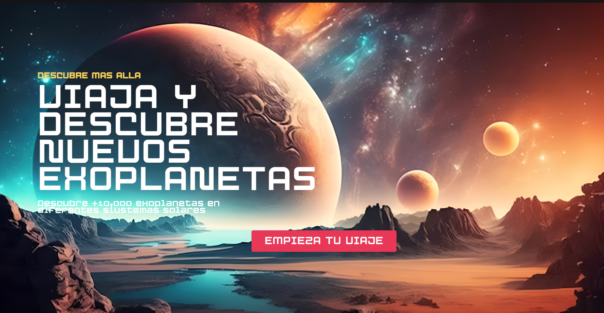

# Descubre Más Allá

## Descripción
**Descubre Más Allá** es una aplicación innovadora que te permite viajar y explorar más de 10,000 exoplanetas en diferentes sistemas solares. Sumérgete en el fascinante mundo de la astronomía y descubre la diversidad de mundos más allá de nuestro propio sistema solar.

## Características
- **Exploración de Exoplanetas**: Accede a una base de datos de más de 10,000 exoplanetas.
- **Sistemas Solares Diversos**: Viaja a través de diferentes sistemas solares y conoce sus características.
- **Interfaz Intuitiva**: Navega fácilmente por la aplicación con una interfaz de usuario amigable.
- **Información Detallada**: Obtén información sobre cada exoplaneta, incluyendo su tamaño, composición y órbita.

## Capturas de Pantalla



## Tecnologías Utilizadas
- **Frontend**: React, Vite
- **Backend**: Node.js, Express
- **Base de Datos**: PostgreSQL
- **Despliegue**: Netlify

## Instalación

Para clonar y ejecutar esta aplicación en tu máquina local, sigue estos pasos:

1. Clona el repositorio:
   ```bash
   git clone https://github.com/ehuallap/nasa-planet-exploration.git
   ```
   
2. Navega al directorio del proyecto:
   ```bash
   cd nasa-planet-exploration
   ```

3. Instala las dependencias:
   ```bash
   npm install
   ```

4. Inicia la aplicación:
   ```bash
   npm run dev
   ```

## Uso
Accede a la aplicación en tu navegador web y comienza a explorar nuevos exoplanetas. Utiliza la barra de búsqueda para encontrar exoplanetas específicos o navega por los sistemas solares disponibles.

## Despliegue
Puedes acceder a la aplicación desplegada en el siguiente enlace:
[Visita la aplicación en Netlify](https://fantastic-custard-6fb545.netlify.app)

## Contribución
Las contribuciones son bienvenidas. Si deseas contribuir, sigue estos pasos:

1. Haz un fork del proyecto.
2. Crea una nueva rama (`git checkout -b feature/nueva-funcionalidad`).
3. Realiza tus cambios y haz un commit (`git commit -m 'Añadir nueva funcionalidad'`).
4. Envía un pull request.

## Licencia
Este proyecto está bajo la licencia MIT. Consulta el archivo [LICENSE](LICENSE) para más detalles.

## Contacto
Para preguntas o comentarios, puedes contactarme a través de [tuemail@ejemplo.com](mailto:tuemail@ejemplo.com).
